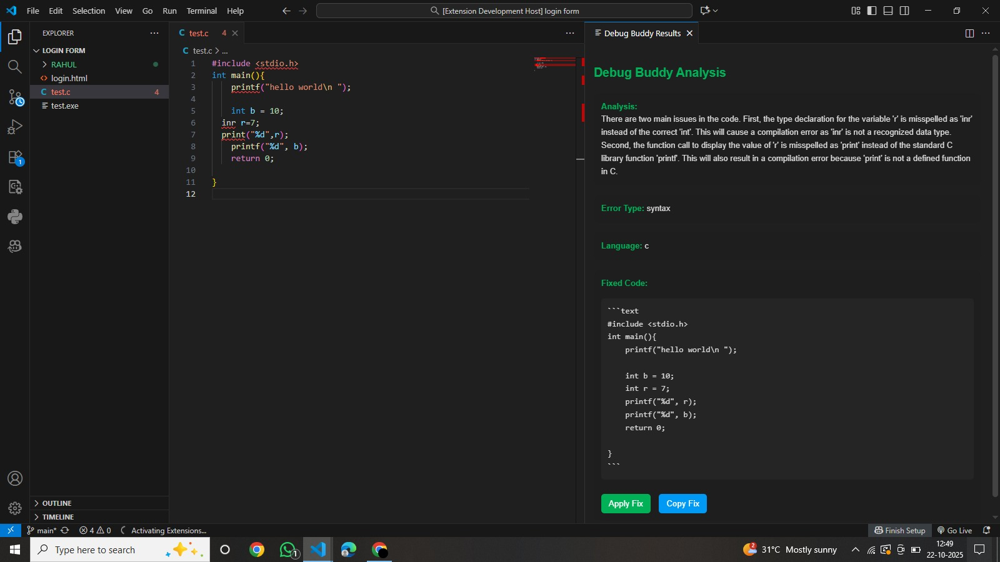

# IntelliPrep

IntelliPrep is a web application paired with its own VS Code extension that helps users identify coding errors and understand them in simple terms. It also tracks each user's progress and highlights frequent mistakes, empowering beginners to monitor their learning journey and grow effectively.

## 📋 Table of Contents
- [About](#-about)
- [Features](#-features)
- [Tech Stack](#-tech-stack)
- [Installation](#-installation)
- [Usage](#-usage)
- [Screenshots](#-screenshots)
- [Extension Demo](#-extension-demo)
- [Future Improvements](#-future-improvements)
- [Contributing](#-contributing)
- [License](#-license)
- [Acknowledgements](#-acknowledgements)
- [Contact](#-contact)

## 🧠 About

IntelliPrep is designed to make coding practice and error correction easier for learners. It integrates with Visual Studio Code to automatically detect and explain coding errors in simple language. The web app tracks user performance, identifies frequent mistakes, and offers insights to help users improve their programming skills over time.

This project aims to reduce the frustration new developers face while debugging and make the learning process more engaging and data-driven.

## ✨ Features

- **🧩 Real-time Error Detection:** Instantly identifies code errors inside VS Code and provides clear, beginner-friendly explanations.  
- **📘 Error Summary:** Each error comes with simplified definitions, causes, and possible solutions to help users truly understand the mistake.  
- **📊 Progress Tracking:** The web app tracks user activity, coding sessions, and recurring errors to measure improvement over time.  
- **🧠 Personalized Learning Insights:** Offers visual analytics on performance and suggests focus areas based on frequent coding issues.  
- **🧑‍💻 VS Code Integration:** Fully integrated with a custom IntelliPrep extension that syncs with the user’s account on the web app.  
- **☁️ Cloud-Based Sync:** Saves user data and progress securely, accessible from any device.  
- **📈 Dashboard View:** Centralized dashboard to view coding stats, solved errors, and overall progress history.  

<!-- \!\[feature X\]\(images/feature-x.png\)

> Tip: Many popular extensions utilize animations. This is an excellent way to show off your extension! We recommend short, focused animations that are easy to follow. -->

## 🧰 Tech Stack

**Frontend:**
- React.js  
- HTML5, CSS3, Tailwind CSS  

**Backend:**
- Node.js  
- Express.js  

**VS Code Extension:**
- JavaScript (VS Code API)  
- REST API integration with IntelliPrep web app  

**Tools & Services:**
- Firebase (Authentication / Cloud Sync)
- Git & GitHub (Version Control)

## ⚙️ Installation

Follow these steps to set up IntelliPrep locally:

### 1️⃣ Clone the Repository
```bash
git clone https://github.com/divyanshjindal-01/IntelliPrep.git
cd intelliprep 
```
2️⃣ Install Dependencies
```bash
cd web
npm install
```
For the VS Code extension:
```
cd extension
npm install
```
3️⃣ Start the Development Server

For the web app:
```
npm start
```
4️⃣ Done 🎉

Your IntelliPrep web app and extension are now running locally!

## 🚀 Usage

Once IntelliPrep is installed and running, follow these steps to get started:

### 1️⃣ Using the Web App
1. Open your browser and go to `http://localhost:3000`.  
2. Sign up or log in to your account.  
3. Navigate to your dashboard to track coding progress and frequent errors.  
4. Click on any error entry to see a **simplified explanation** and suggested fixes.  

### 2️⃣ Using the VS Code Extension
1. Open your code project in VS Code.  
2. Activate the IntelliPrep extension from the Extensions sidebar.  
3. IntelliPrep will automatically detect errors in your code and highlight them.  
4. Hover over highlighted errors to see **detailed explanations**.  
5. Sync your progress with the web app for tracking and analytics.  

### 3️⃣ Example Workflow
```bash
# Write some sample code with a deliberate error
# IntelliPrep will highlight and explain the error
# Check your web dashboard to see progress and frequent mistakes
```

## 🖼 Screenshots

### Web App Dashboard
The main dashboard shows your coding progress, frequent errors, and analytics:


### Error Summary View
Clicking on an error provides a simplified explanation with possible fixes:



---

## 🎬 Extension Demo

Watch IntelliPrep detect errors and explain them directly in VS Code:


**How it works:**
1. Open a coding file in VS Code.  
2. IntelliPrep highlights errors in real-time.  
3. Hover over the highlighted errors to see explanations and suggested fixes.  
4. Sync your progress with the web app dashboard automatically.

## 🚧 Future Improvements

IntelliPrep is continuously evolving. Planned enhancements include:

- **🎨 Improved Design:** Make the web app and extension UI more intuitive and visually appealing.  
- **🔔 Notifications:** Alert users about repeated errors, milestones, or progress reminders.  
- **📊 Advanced Analytics:** Analyze user progress and suggest the next topics to focus on for faster learning.  
- **🎯 Goal Tracking & Custom Roadmaps:** Allow users to set predefined goals and track their progress with personalized learning roadmaps.  
- **💡 AI-Powered Recommendations:** Suggest coding exercises or resources based on frequent errors and performance trends.

## 🤝 Contributing

Contributions are always welcome!  

If you’d like to improve IntelliPrep, follow these steps:

1. **Fork** the repository.  
2. **Create a new branch** for your feature or bug fix:  
   ```bash
   git checkout -b feature-name
   ```
Commit your changes:
```
git commit -m "Add new feature"
```

Push to your branch:
```
git push origin feature-name
```

Open a Pull Request describing your changes.
```bash
# Please make sure your code follows the project’s
# structure and includes proper comments for readability
```

## 🙌 Acknowledgements

A special thanks to everyone who contributed ideas and support to IntelliPrep’s development.

**Built with ❤️ using:**
- [React.js](https://react.dev/)
- [Node.js](https://nodejs.org/)
- [Express.js](https://expressjs.com/)
- [MongoDB](https://www.mongodb.com/)
- [Visual Studio Code API](https://code.visualstudio.com/api)

And to all the open-source tools and libraries that made this project possible!
## 📞 Contact

**Author:** Divyanshu Jindal  
**GitHub:** [@DivyanshJindal](https://github.com/divyanshjindal-01)  
**Email:** divyanshjindal.05@gmail.com
